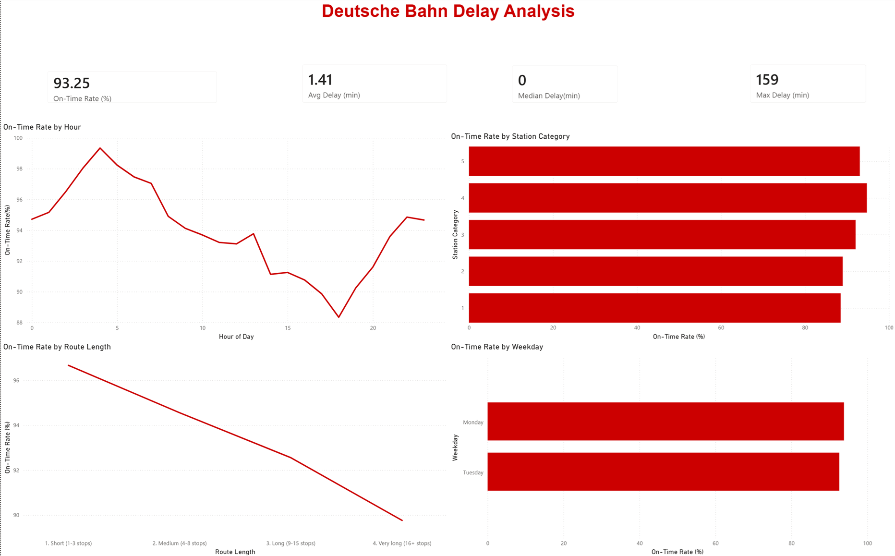
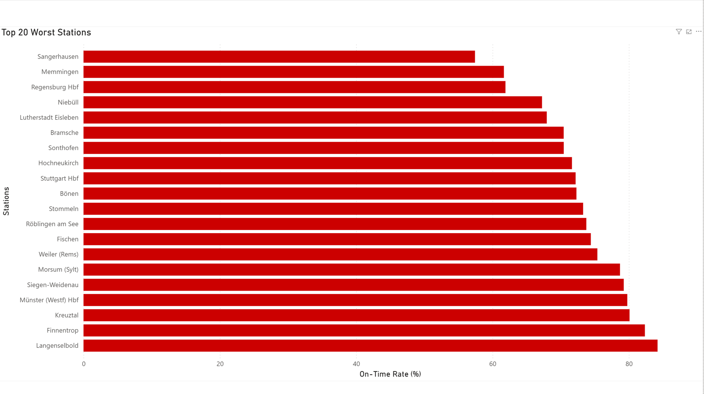

# Deutsche Bahn Delay Analysis

Analyzing 1.85 million train arrival events across Germany to understand when, where, and why delays occur from the perspective of an everyday traveler.

---

## Dashboard Preview




---

## Project Overview

This is an end-to-end data analytics project built as part of my portfolio while studying Software Design at TH Aschaffenburg.

The dataset covers one week of DB train arrivals (July 8–10, 2024 — 3 full days usable) across Germany. The goal was to answer practical traveler questions: Is my train likely to be on time? Does it matter what time I travel, or which station I use?

**Stakeholder:** The everyday train traveler, not DB operations.

---

## Key Findings

| Question | Finding |
|---|---|
| Overall punctuality | 94.0% of arrivals on time (≤5 min threshold) — better than expected |
| By station category | Major hubs (cat 1–2) are *worse* at ~89% vs. smaller stations at ~94% |
| By time of day | Delays build throughout the day — worst at 6 PM (89.3% on-time), best at 4 AM |
| By route length | Longer routes accumulate more delay — 16+ stops: 90.1% vs. 1–3 stops: 96.7% |
| Worst stations | Top 20 worst are small/medium stations in the Frankfurt–Fulda corridor, not major hubs |

**Unifying insight:** All findings point to one mechanism — *delay propagation*. The network has limited slack, and lateness spreads across time, route length, and network position.

---

## Tech Stack

| Tool | Purpose |
|---|---|
| Python + pandas | Exploration and cleaning |
| PostgreSQL | Storing and querying 1.85M rows |
| SQLAlchemy + psycopg2 | Python–PostgreSQL connection |
| Power BI Desktop | Dashboard |
| Git + GitHub | Version control |

---

## Project Structure

```
db_delays-analysis/
├── data/                        # Raw + cleaned data (gitignored)
├── notebooks/
│   ├── 01_exploration.ipynb     # Initial data exploration
│   ├── 02_cleaning.ipynb        # Cleaning + feature engineering
│   └── 03_load_to_postgres.ipynb# Load to PostgreSQL + SQL analysis
├── sql/
│   ├── 01_overall_punctuality.sql
│   ├── 02_delays_by_category.sql
│   ├── 03_delays_by_hour.sql
│   ├── 04_delays_by_weekday.sql
│   ├── 05_worst_stations.sql
│   └── 06_route_length.sql
├── dashboard/
│   ├── db_delays_dashboard.pbix
│   ├── dashboard_overview.png
│   └── dashboard_stations.png
├── questions.md                 # Business questions + predictions
├── requirements.txt
└── README.md
```

---

## How to Reproduce

1. **Clone the repo**
   ```bash
   git clone https://github.com/sb-2002/db_delays-analysis.git
   cd db_delays-analysis
   ```

2. **Set up virtual environment**
   ```bash
   python -m venv .venv
   .venv\Scripts\activate       # Windows
   pip install -r requirements.txt
   ```

3. **Download the dataset**
   From [Kaggle — nokkyu/deutsche-bahn-db-delays](https://www.kaggle.com/datasets/nokkyu/deutsche-bahn-db-delays), place `DBtrainrides.csv` in `data/`.

4. **Configure database credentials**
   Create a `.env` file in the project root:
   ```
   DB_USER=your_user
   DB_PASSWORD=your_password
   DB_HOST=localhost
   DB_PORT=5432
   DB_NAME=db_delays
   ```

5. **Run notebooks in order**
   `01_exploration` → `02_cleaning` → `03_load_to_postgres`

6. **Open the dashboard**
   Open `dashboard/db_delays_dashboard.pbix` in Power BI Desktop.

---

## Data Source

Kaggle: [nokkyu/deutsche-bahn-db-delays](https://www.kaggle.com/datasets/nokkyu/deutsche-bahn-db-delays)  
Raw dataset: 2,061,357 rows × 20 columns. After cleaning: 1,850,002 rows.

---

## Limitations

- Dataset covers only 3 full days (Mon–Wed, July 8–10, 2024). Findings cannot be generalized to seasonal patterns, weekends, or long-term trends.
- The worst-station ranking may reflect temporary disruptions during that specific week rather than structural issues.
- No train-type information available in the dataset (ICE vs. Regional vs. S-Bahn).